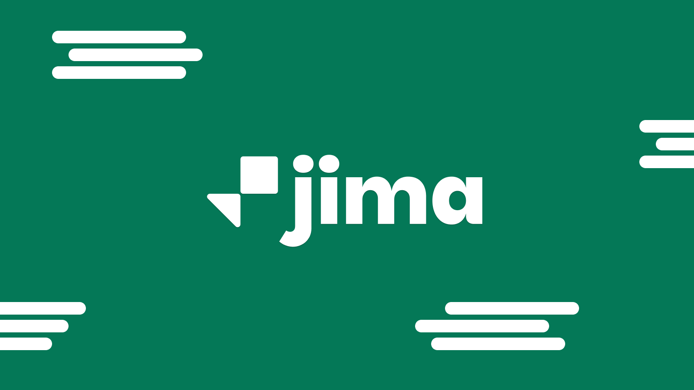

Jima is an AI Captions & Motion tool I planned, designed, and developed with the help of Claude Code.

It’s open source, 100% free, and built with privacy by design in mind. I created Jima because I wanted my own captions and motion suite without having to pay for expensive subscriptions.

Claude Code made it possible to bring my Figma designs and product idea of Jima to life.

## Who is the Target Audience?

Jima is made for video editors. Especially creators making short-form content for TikTok, Instagram Reels, and YouTube Shorts.

It’s for people who value open source, want complete private control over their content, and are just starting their content-creation journey.

## What was the goal of building Jima?

The main goal of Jima was to create a privacy-by-design tool that generates captions using OpenAI’s Whisper speech-recognition model.

It lets creators quickly edit videos without uploading their files to someone else’s server. Jima is built so that no backend server ever receives the files, text, assets, or other content uploaded to the tool.

I built it because I needed a tool like this for creating short-form content myself.

## More Previews of Jima

Here are some more visual Previews of Jima.

