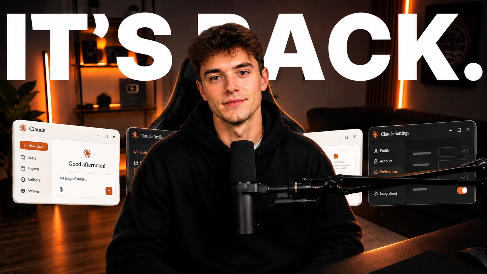
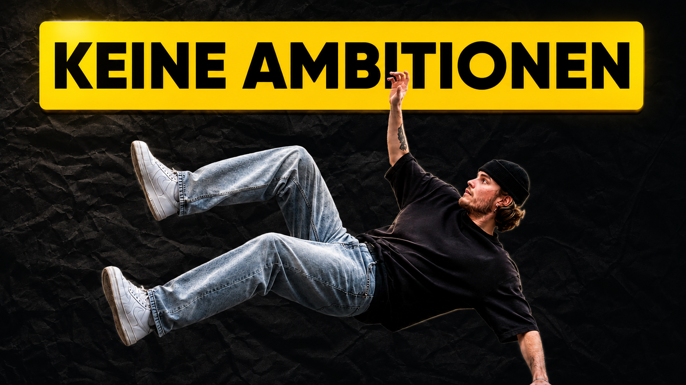
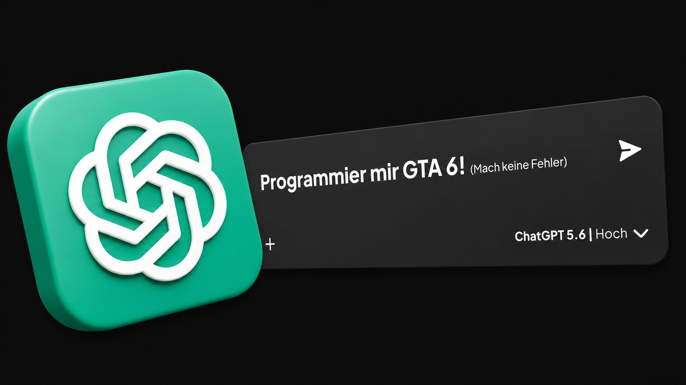
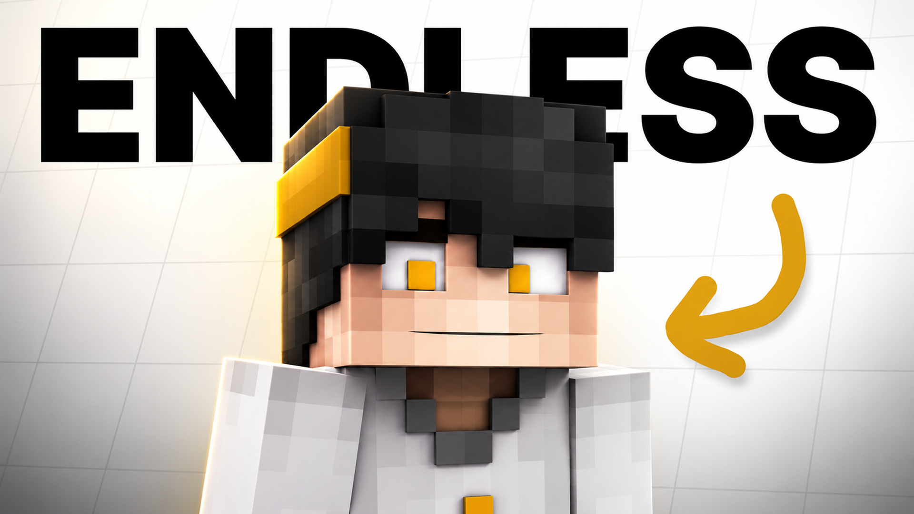
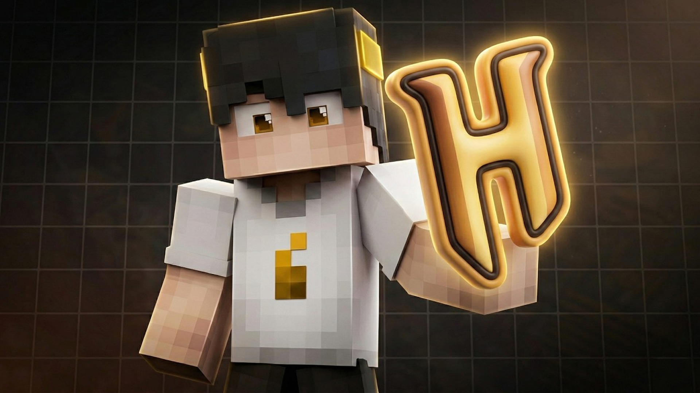
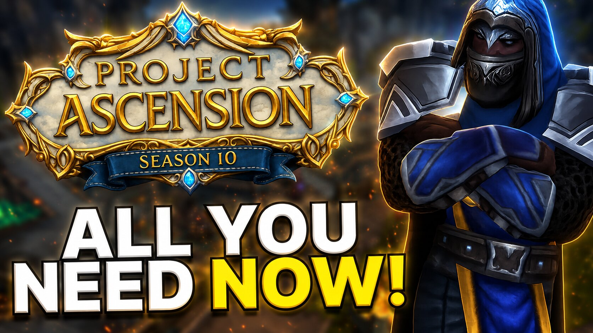

## Thumbnails (Tech/IRL)

Below are a few selected thumbnails I’ve created over the past months and years. Most were made for my own projects or as fictional concepts.

I create my thumbnails using Adobe Photoshop and Figma, with ChatGPT and Gemini helping with refinements. My main focus is on YouTube thumbnails for gaming, tech, and IRL content.

## Thumbnails (Gaming)

