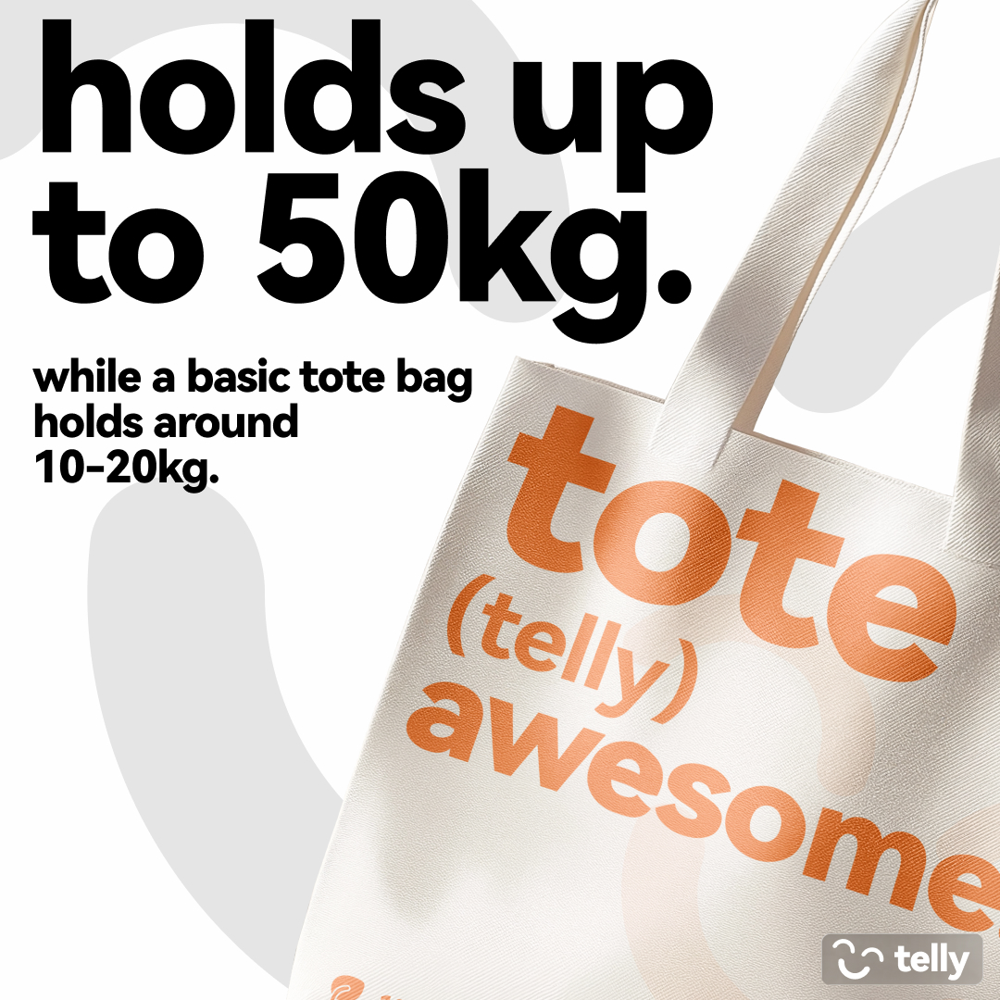
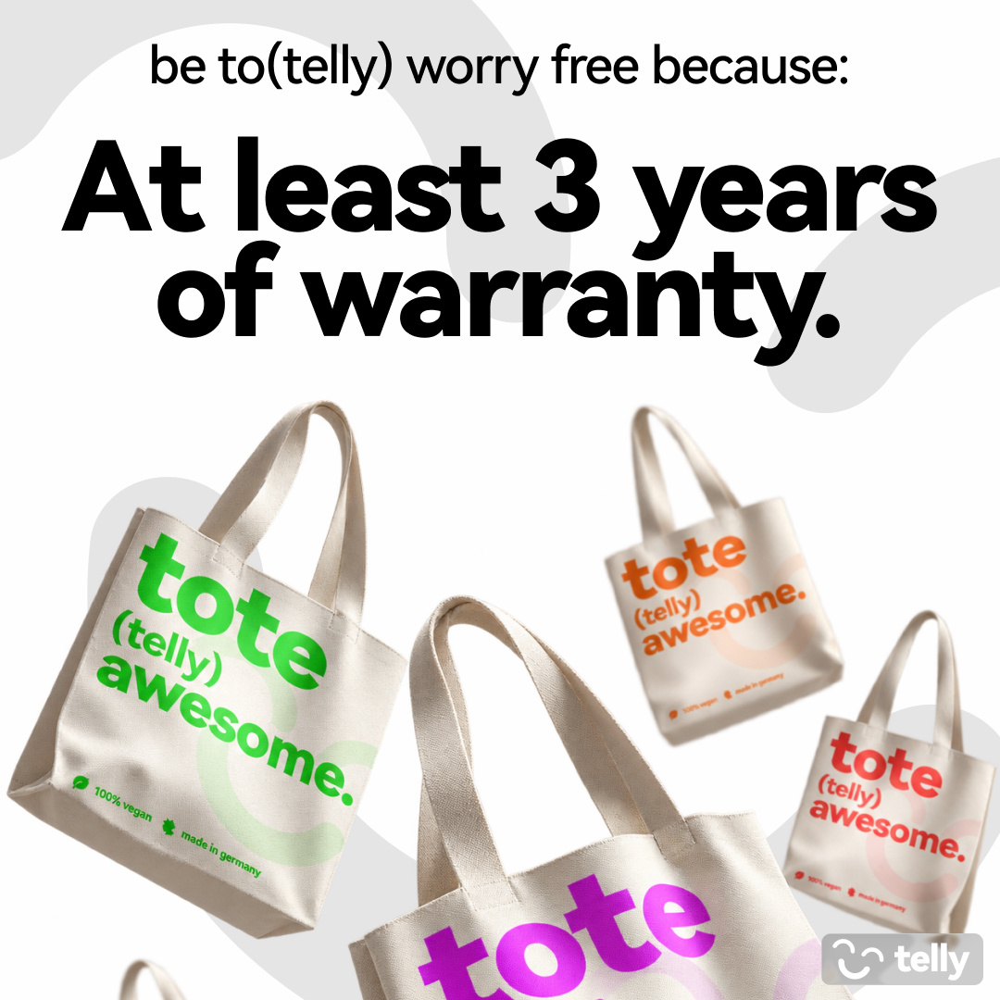

## What is an Amazon Listing Design?
An Amazon listing is a gallery of 6–8 product images on a product page, combining hero shots, infographics, and lifestyle photography to communicate a product's value and convince shoppers to buy. All within seconds of scrolling.

## The Problem
- The hero image of the gallery has to show the product in its best light and thats on a plain white background
- A Amazon products images have to catch the users eye in an instant. There is so much competition for every product on Amazon, that yours have to be outstanding
- The infographics have to invaluate doubts of purchasing: e.g. "is the quality even good?", "does the imprint last long?", "is there a color that I like?". If the customer is not feeling a benefit or a support of their believes through your product, you lose a potential customer

## The Objectives
- Show how the tote bag looks, highlight different colors, and compare the telly tote bag with other tote bags
- Clearly show highlights of this tote bag, that it's produced fair, vegan and contains 100% cotton, it's water resistance, the quality printing method, the long durability and the option to print your own text on it
- Show that wearing this tote bag is a statement and not just another bag which lands in your wardrobe

## The Process

### 01 - Competition
Most of the products shows when a customer is looking for "Jutebeutel" or "Baumwolltasche" are plain and simple - mostly multi-pack - tote bags. I've decided to create a design for "THE tote bag" not just "a tote bag". Because telly is not made to be one of many, it's meant to support the envoirment, be long-lasting and
offers a modern and timeless design, which you can even customize with a text of your own.

That means I focused on presenting a ready made and printed tote bag instead of a plain nature color one in the hero image slot of the listing design.

### 02 - The Sequence of Images
Right after you open the listing, the first image tells you, that there is not only a black version but actually many different colors. On Amazon you
are able to pick your own color for products, that's why I spared the customer with listing every single color of the product and instead show them the
claim, that there are many colors.

After that the customer gets explained why telly is the perfect fit for them and why they should not buy "just a random new tote bag" for their collection which is getting dusty in the wardrobe.

If they get convinced by good quality and the fair and long lasting quality of the product, they will see a lifestyle image of the product with a social-proof of telly being one of them. Be pride to wear color and quality.

After these initial images they see that they can even customize it, get another benefit over the competition (being more durable) and that they can use a telly tote bag for at least three years without ever worrying about it breaking.

## Final Outcome

